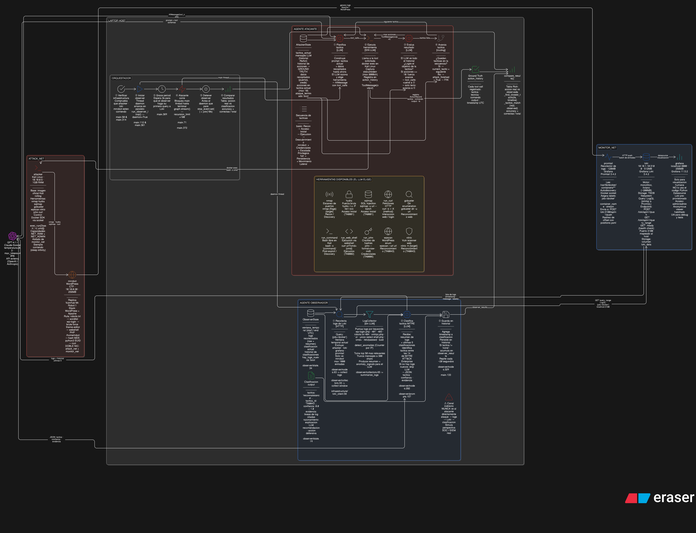

# Sistema Adversarial MITRE ATT&CK

Plataforma de investigación que simula cadenas de ataque reales y clasifica automáticamente las tácticas ejecutadas usando la taxonomía MITRE ATT&CK. Desarrollado como proyecto de tesis en la USFQ (2026).

## Arquitectura



El sistema opera con dos agentes autónomos que corren en paralelo sin comunicación directa:

| Agente | Modelo | Patrón | Rol |
|--------|--------|--------|-----|
| Atacante | GPT-4.1 | ReAct | Ejecuta la cadena de ataque contra la red objetivo |
| Observador | GPT-4o-mini | Grafo condicional | Analiza logs y clasifica tácticas en tiempo real |

El único canal entre agentes es indirecto: el atacante genera actividad de red, el observador la lee desde Loki.

## Componentes

```
src/
  agents/
    attacker/     # Agente atacante: grafo ReAct con herramientas de pentesting
    observer/     # Agente observador: pipeline de 5 nodos con triaje de logs
  config/         # Settings y variables de entorno
  infrastructure/ # Cliente Docker SDK, consultas Loki
  llm/            # Proveedores de modelos (OpenAI)
docker/
  docker-compose.yml   # Red objetivo + stack de observabilidad
```

### Agente Atacante — grafo ReAct

Ciclo `razona → actúa → observa` sobre herramientas de pentesting ejecutadas dentro de un contenedor Kali Linux aislado. Implementado con LangGraph. Tácticas disponibles: Reconnaissance, Initial Access, Execution, Discovery.

### Agente Observador — grafo condicional

Pipeline de cinco nodos:

1. **collect_logs** — consulta Loki (LogQL, hasta 5000 entradas)
2. **detect_anomalies** — perfilado de IPs sin LLM
3. **triage** — clasifica si hay actividad relevante (`attack` / `normal` / `uncertain`)
4. **classify_tactic** — infiere táctica MITRE con GPT-4o-mini
5. **generate_recommendation** — produce recomendación para el analista

En caso de actividad normal, el grafo salta directamente de `triage` al final.

## Infraestructura Docker

Seis contenedores en dos redes aisladas:

| Contenedor | Red | Función |
|------------|-----|---------|
| `attacker` | attack-net (10.10.0.0/24) | Kali Linux con herramientas de pentesting |
| `target` | attack-net + log-net | Servidor vulnerable (Apache/WordPress) |
| `promtail` | log-net | Recolección de logs |
| `loki` | log-net (10.10.1.3) | Almacenamiento y consulta de logs |
| `grafana` | log-net | Visualización |
| `orchestrator` | ambas | Coordina los dos agentes |

Para el escenario Mr. Robot se añade un séptimo contenedor con la imagen `linuxserver/mr-robot`.

## Escenarios de evaluación

**Escenario básico** — cadena de 4 tácticas sobre servidor Apache/WordPress genérico:
1. Reconnaissance (nmap)
2. Initial Access (wpscan + fuerza bruta)
3. Execution (webshell)
4. Discovery (enumeración interna)

**Escenario Mr. Robot** — 6 tácticas sobre réplica de la máquina VulnHub Mr. Robot:
1. Reconnaissance → 2. Initial Access → 3. Execution → 4. Persistence → 5. Privilege Escalation → 6. Credential Access

## Resultados preliminares

| Métrica | Escenario básico | Mr. Robot |
|---------|-----------------|-----------|
| Clasificación (match estricto) | 100% (1/1) | 50% (3/6) |
| Confianza media del observador | 98% | — |
| Tiempo de ejecución | ~4 min | ~12 min |

El match estricto requiere que la táctica clasificada por el observador coincida exactamente con la táctica activa del atacante en ese instante.

## Requisitos

- Python 3.11+
- Docker y Docker Compose
- API key de OpenAI

## Instalación

```bash
git clone https://github.com/Crescendum429/mitre-adversarial-system
cd mitre-adversarial-system
poetry install
cp .env.example .env
# Añadir OPENAI_API_KEY en .env
```

## Uso

```bash
# Levantar infraestructura
docker compose -f docker/docker-compose.yml up -d

# Escenario básico
poetry run python -m src.main --scenario basic

# Escenario Mr. Robot
poetry run python -m src.main --scenario mrrobot
```

## Stack tecnológico

- **LangGraph** — orquestación de grafos de agentes
- **LangChain OpenAI** — integración con GPT-4.1 / GPT-4o-mini
- **Docker SDK** — ejecución de herramientas de pentesting en contenedor aislado
- **Loki + Promtail** — recolección y consulta de logs
- **Pydantic Settings** — configuración tipada

## Aviso sobre uso de IA

Este sistema fue desarrollado por Jesús Alarcón como proyecto de tesis bajo supervisión de Roberto Andrade (USFQ, 2026). Se usaron herramientas de IA (Claude Code, ChatGPT) como apoyo en depuración y revisión de código. El diseño de la arquitectura, la formulación de la pregunta de investigación, la selección del stack y la validación experimental son trabajo original del autor.
