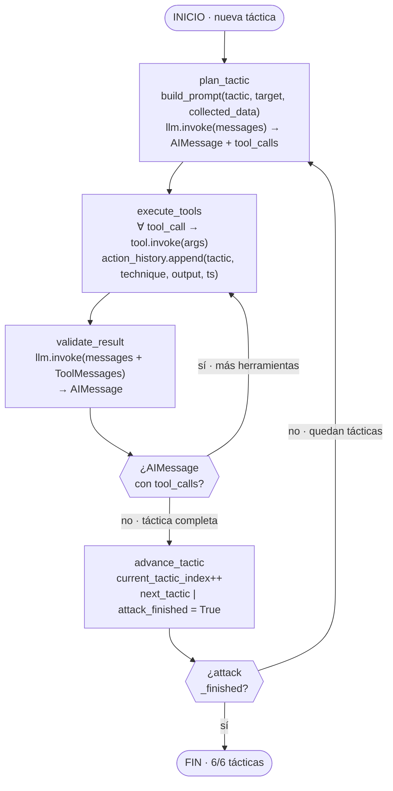
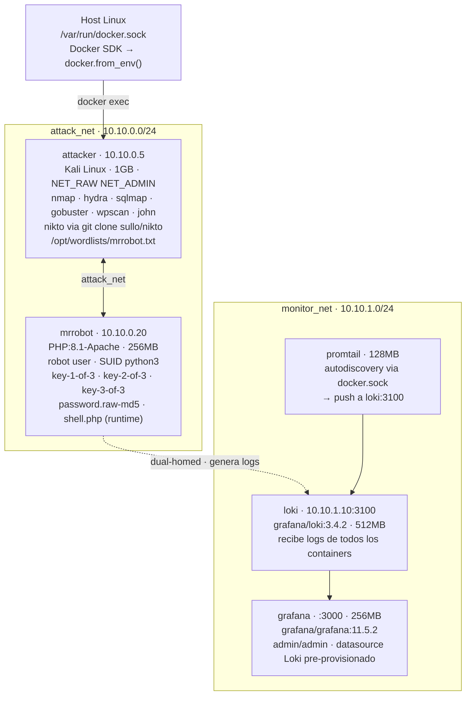

# Arquitectura Micro-Nivel — Sistema Adversarial MITRE ATT&CK

Para visualizar: pega cada bloque en https://mermaid.live

---

## Diagrama 1 — Vista General del Sistema

```mermaid
flowchart TD

    subgraph CLI["Orquestador · main.py"]
        cli["--scenario mrrobot\nverify_infrastructure → run_attacker"]
    end

    subgraph GRAPH["Grafo · graph.py + state.py"]
        graph["StateGraph(AttackerState)\ngraph.stream(state, recursion_limit=100)"]
    end

    subgraph LLM_B["Proveedor LLM · provider.py"]
        llm["ChatOpenAI gpt-4-turbo\nbind_tools(10 tools) · temp=0.3"]
    end

    subgraph REACT_B["Loop ReAct · nodes.py"]
        direction LR
        plan["plan_tactic"]
        exec["execute_tools"]
        vali["validate_result"]
        adva["advance_tactic"]
        plan --> exec --> vali --> adva
        adva -->|siguiente táctica| plan
    end

    subgraph TOOLS_B["Herramientas · tools.py"]
        tools["nmap · nikto · hydra · wpscan\ncurl · gobuster · web_shell\njohn · command · sqlmap"]
    end

    subgraph SDK_B["Docker SDK · docker_client.py"]
        sdk["exec_run(cmd, demux=True)\n→ ExecResult(exit_code, stdout, stderr)"]
    end

    subgraph INFRA_B["Infraestructura · docker-compose.yml"]
        direction LR
        subgraph ANET["attack_net · 10.10.0.0/24"]
            atk["attacker\n10.10.0.5 · 1GB · Kali"]
            mrr["mrrobot\n10.10.0.20 · 256MB · PHP:8.1"]
        end
        subgraph MNET["monitor_net · 10.10.1.0/24"]
            lok["loki · :3100"]
            pmt["promtail · 128MB"]
            grf["grafana · :3000"]
        end
        pmt --> lok --> grf
        mrr -. logs .-> lok
    end

    cli --> graph --> plan
    llm -. modelo .-> plan
    llm -. modelo .-> vali
    exec --> tools --> sdk
    sdk -->|ExecResult| exec
    sdk -. docker exec .-> atk
```

---

## Diagrama 2 — Loop ReAct: Algoritmo Detallado



---

## Diagrama 3 — Infraestructura Docker


